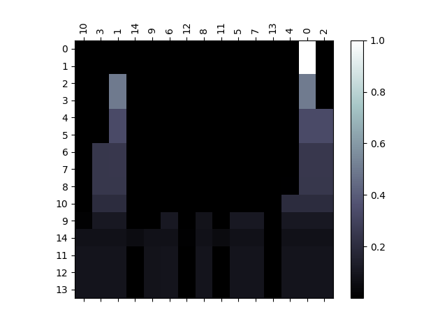
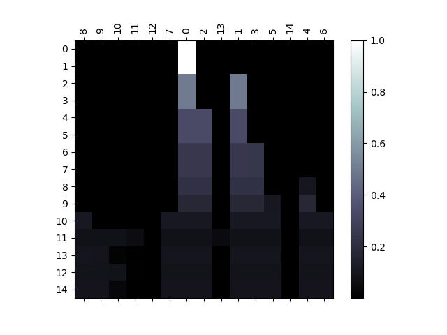
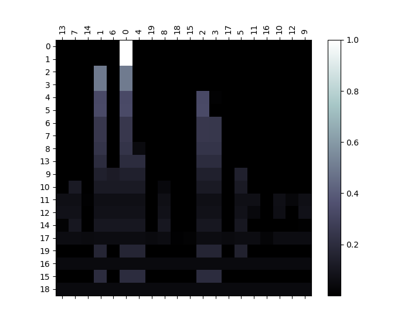
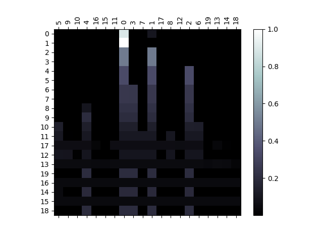

# neural-combinatorial-rl-pytorch

**WORK IN PROGRESS**

**UPDATE 10/30/17** Was unable to get the RL pretraining model with greedy decoding to learn on the TSP10 or TSP20 environments. I tried a critic network as well as an exponential moving average baseline. I am using 1 NVIDIA GTX 1080 and trained for 1-2 days. It appears as if the variance of the actor loss is still too high, even with these baselines. Please create an Issue and let me know if you get this to work.

PyTorch implementation of [Neural Combinatorial Optimization with Reinforcement Learning](https://arxiv.org/abs/1611.09940). 

I have implemented the basic RL pretraining model from the paper. An implementation of the supervised learning baseline model is available [here](https://github.com/pemami4911/neural-combinatorial-rl-tensorflow). 

My implementation uses a stochastic decoding policy in the pointer network, realized via PyTorch's `torch.multinomial()`, during training, and beam search (not yet finished, only supports 1 beam a.k.a. greedy) for decoding when testing the model. I have tried to use the same hyperparameters as mentioned in the paper but have not yet been able to replicate results from TSP. 

Currently, there is support for a sorting task and the Planar Symmetric Euclidean TSP.

See `main.sh` for an example of how to write a bash script to easily set the run parameters.

## TODO

* [ ] Finish implementing beam search decoding to support > 1 beam
* [ ] Add support for variable length inputs
* [ ] Distributed implementation

Examples: 

To run `sort_10`:
    
    ./trainer.py --task sort_10 --beam_size 1 --random_seed 1234 --run_name sort_10-seed-1234

To run `tsp_50`:

    ./trainer.py --task tsp_50 --beam_size 1 --random_seed 1234 --run_name tsp_50-seed-1234 

To load a saved model trained on `sort_10` and test on `sort_15`:

    ./trainer.py --task --beam_size 3 sort_15 --max_decoder_len 15 --load_path outputs/sort_10/24601-dropout-0.1/epoch-3.pt --run_name 24601-sort15-epoch-3 --is_train False

To load a saved model and view the pointer network's attention layer:

    ./trainer.py --task sort_15 --beam_size 1 --max_decoder_len 15 --load_path outputs/sort_10/24601/epoch-3.pt --run_name 24601-sort_15-attend --is_train False --disable_tensorboard True --plot_attention True

Please, feel free to notify me if you encounter any errors, or if you'd like to submit a pull request to improve this implementation.

## Adding other tasks

This implementation can be extended to support other combinatorial optimization problems. See `sorting_task.py` and `tsp_task.py` for examples on how to add. The key thing is to provide a dataset class and a reward function that takes in a sample solution, selected by the pointer network from the input, and returns a scalar reward. For the sorting task, the agent received a reward proportional to the length of the longest strictly increasing subsequence in the decoded output (e.g., `[1, 3, 5, 2, 4] -> 3/5 = 0.6`).

## Dependencies

* Python=3.6 (should be OK with v >= 3.4)
* PyTorch=0.2
* tqdm
* matplotlib
* [tensorboard_logger](https://github.com/TeamHG-Memex/tensorboard_logger)

## Results

I trained a model on `sort10` for 4 epochs of 1,000,000 randomly generated samples. I tested it on a dataset of size 10,000. Then, I tested the same model on `sort15` and `sort20` to test the generalization capabilities.

Test results on 10,000 samples (A reward of 1.0 means the network perfectly sorted the input): 

| task | average reward | variance | 
|---|---|---|
| sort10 | 0.9966 | 0.0005 |
| sort15 | 0.7484 | 0.0177 |
| sort20 | 0.5586 | 0.0060 | 


Example prediction on `sort10`: 

```
input: [4, 7, 5, 0, 3, 2, 6, 8, 9, 1]
output: [0, 1, 2, 3, 4, 5, 6, 7, 8, 9]
```

### Attention visualization

Plot the pointer network's attention layer with the argument `--plot_attention True`

Examples: 

`sort10`: 


During greedy decoding, after making a selection, the logits for that index for the input is set to 0 for the rest of the decoding process.

`sort15`:





`sort20`:



Zoomed in slightly. Notice how the network doesn't really know how to handle higher numbers it wasn't trained on! But, it understands that they belong closer to the end of the output sequence.



## TODO

* [ ] Add RL pretraiing-Sampling
* [ ] Add RL pretraining-Active Search
* [ ] Active Search
* [ ] Asynchronous training a la A3C
* [ ] Refactor `USE_CUDA` variable

## Acknowledgements

Special thanks to the repos [devsisters/neural-combinatorial-rl-tensorflow](https://github.com/devsisters/neural-combinatorial-rl-tensorflow) and [MaximumEntropy/Seq2Seq-PyTorch](https://github.com/MaximumEntropy/Seq2Seq-PyTorch) for getting me started. 

